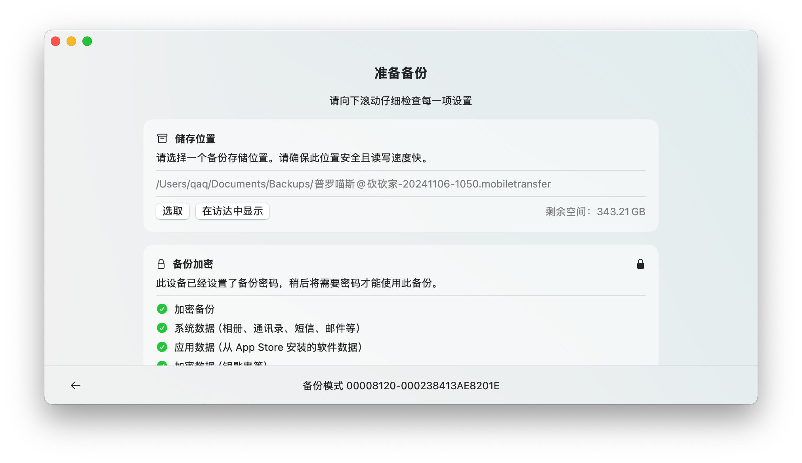

# MobileTransfer

MobileTransfer is an app operating on MobileBackup (`idevicebackup2`). It offers a way to backup and restore data on iOS devices.

## Features

- [x] Backup and restore data on iOS devices
- [x] Convert backup from [BBackupp](https://github.com/Lakr233/BBackupp)
- [x] Backup and restore apps (experimental, currently broken due to API change)
- [x] Set backup password
- [x] Backup to custom path and restore from there
- [x] Increment backup (menu -> backup -> load checkpoint)

## Special Note

This app was previously designed to be a paid app, but we are unable to provide reliable service on application backup/restore, and we have stopped developing or maintaining this app. We are open-sourcing this project to let the community continue the development.

## Activation

To use this app, enter any email address and license key during the activation prompt.

## License

This project is licensed under the MIT License - see the [LICENSE](./LICENSE) file for details.

---

Copyright © 2025 Lakr Aream. All Rights Reserved.
